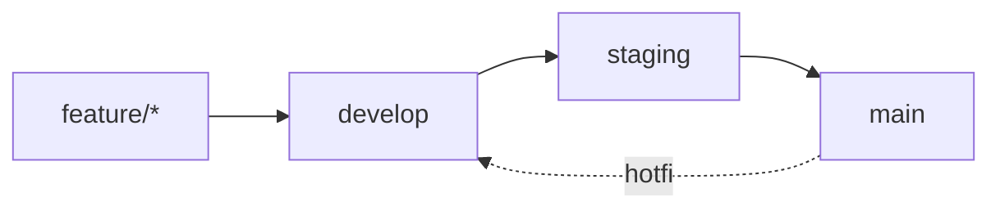

# Git-Flow Quick Reference

## Branch Strategy

```
develop  → CI only (keine Deployments)
staging  → Staging Deployment (Pre-Production)
main     → Production Deployment
```

## Branch Flow



## Quick Commands

### Start New Feature
```bash
git checkout develop
git pull origin develop
git checkout -b feature/my-feature
# ... work ...
git push origin feature/my-feature
# Create PR: feature/my-feature → develop
```

### Promote to Staging
```bash
git checkout staging
git pull origin staging
git merge develop
git push origin staging
# Or: Create PR: develop → staging
# 🚀 Auto-deploys to staging
```

### Promote to Production
```bash
git checkout main
git pull origin main
git merge staging
git push origin main
# Or: Create PR: staging → main
# 🚀 Auto-deploys to production
```

### Hotfix Production
```bash
git checkout main
git pull origin main
git checkout -b hotfix/critical-fix
# ... fix ...
git push origin hotfix/critical-fix
# Create PR: hotfix/critical-fix → main
# Then merge main back to develop
```

## Branch Protection

| Branch    | Reviewers | CI Required | Deploy |
|-----------|-----------|-------------|--------|
| `develop` | 1         | ✅          | ❌     |
| `staging` | 1         | ✅          | ✅     |
| `main`    | 2         | ✅          | ✅     |

## Workflow Overview

```
1. Feature Development:    feature/xxx → develop (CI only)
2. Staging Testing:        develop → staging (Deploy + Test)
3. Production Release:     staging → main (Deploy to Prod)
```

## CI/CD Matrix

| Event              | Branch    | CI | Deploy | Environment |
|--------------------|-----------|-----|--------|-------------|
| PR created         | Any       | ✅  | ❌     | None        |
| PR merged          | develop   | ✅  | ❌     | None        |
| PR merged          | staging   | ✅  | ✅     | Staging     |
| PR merged          | main      | ✅  | ✅     | Production  |

## Need Help?

See [CONTRIBUTING.md](../CONTRIBUTING.md) for detailed workflow documentation.
